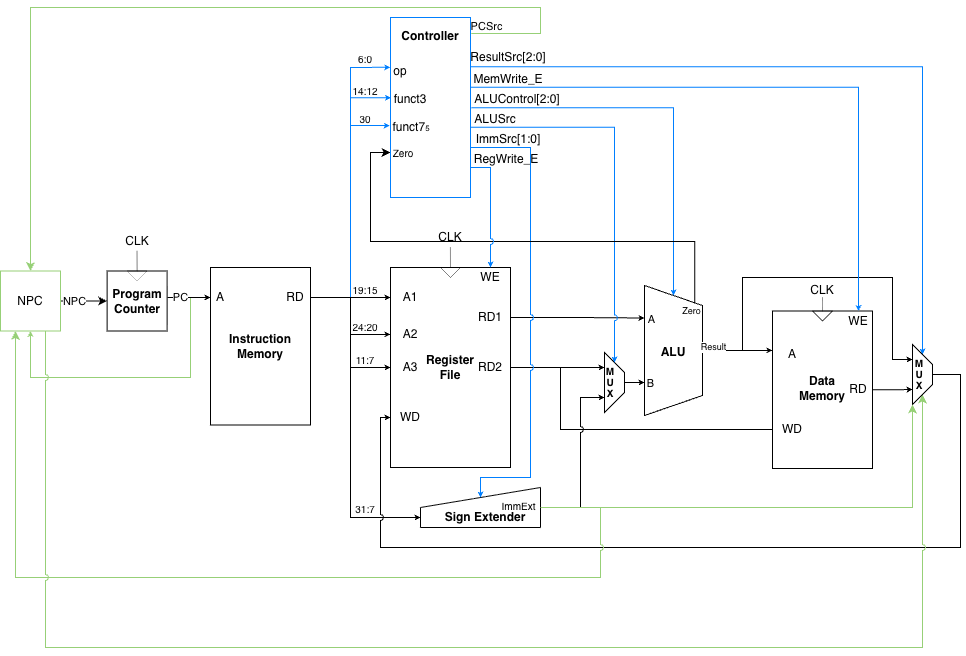
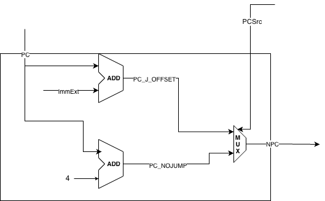
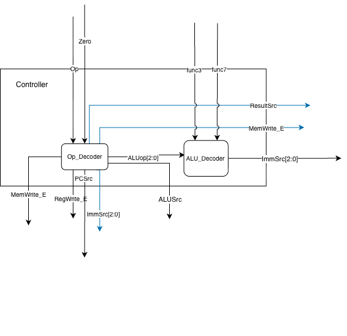
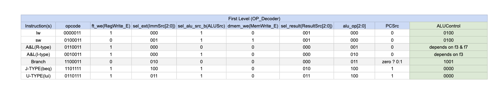
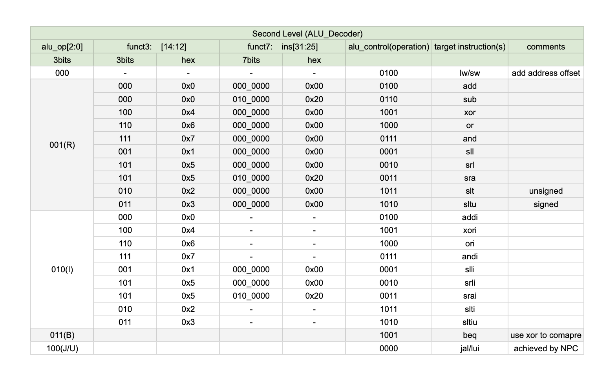
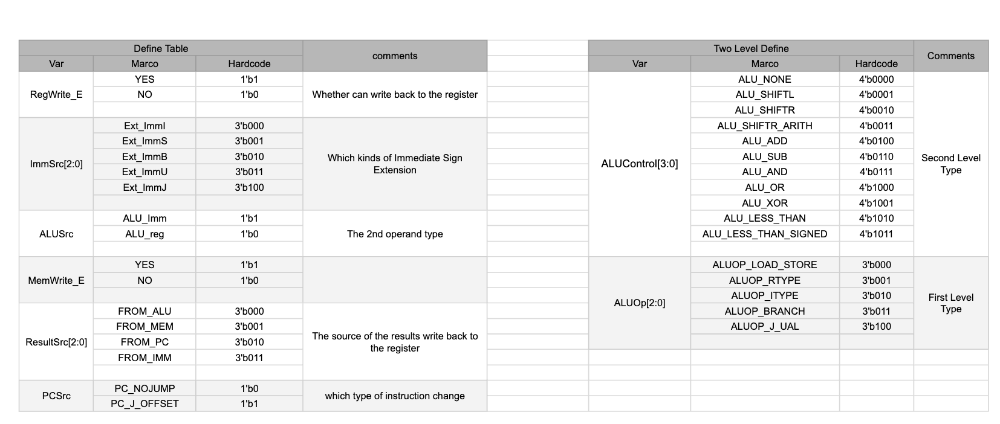

# RISC-V Single Cycle CPU

A complete implementation of a 32-bit single-cycle RISC-V processor in Verilog, supporting a subset of the RV32I base instruction set. This project focuses on essential components including the controller, immediate extension unit, ALU interface, and next-PC logic.


## Project Structure

```
riscv-single/
├── src/                          # Verilog source files
├── testbench/                    # Testbench files
├── assembly/                     # Assembly programs and machine code
├── assets/                       # Documentation assets
├── compiler_helper.py            # Automated compilation tool
└── README.md                     # This file
```

## Supported Instructions

The CPU implements the following RV32I instructions:

### Arithmetic & Logic
- **R-type**: `ADD`, `SUB`, `AND`, `OR`, `XOR`, `SLL`, `SRL`, `SRA`, `SLT`, `SLTU`
- **I-type**: `ADDI`, `ANDI`, `ORI`, `XORI`, `SLLI`, `SRLI`, `SRAI`, `SLTI`, `SLTIU`

### Memory Access
- **Load**: `LW` (Load Word)
- **Store**: `SW` (Store Word)

### Control Flow
- **Branch**: `BEQ` (Branch if Equal)
- **Jump**: `JAL` (Jump and Link)

### Upper Immediate
- **U-type**: `LUI` (Load Upper Immediate)

## Getting Started

### Prerequisites

- **Icarus Verilog** (iverilog): For compilation
- **VVP**: Verilog simulation runtime
- **Python 3**: For the compilation helper script

Install on Ubuntu/Debian:
```bash
sudo apt-get install iverilog python3
```

## Using compiler_helper.py

The `compiler_helper.py` script automates module compilation and testing.

**Basic usage:**
```bash
./compiler_helper.py Module_name    # Test specific module
./compiler_helper.py <module_name>  # Compile and test a module
./compiler_helper.py --all          # Run all tests
./compiler_helper.py -h             # Show all options
```

## Manual Testing

```bash
cd testbench
iverilog -I ../src -o alu_test ALU_tb.v
vvp alu_test
gtkwave ALU_tb.vcd  # View waveform
```

## CPU Architecture

The single-cycle CPU follows a classic datapath design with some key enhancements:

### Overall Architecture


*Figure: Complete CPU architecture showing all major components and data paths*

The CPU executes instructions in the following stages:

1. **Fetch**: PC → Instruction Memory → Instruction
2. **Decode**: Instruction → Controller → Control Signals
3. **Execute**: ALU performs operation
4. **Memory**: Load/Store access Data Memory
5. **Write Back**: Result written to Register File

All operations complete in one clock cycle.

### NPC (Next Program Counter) Module



*Figure: NPC module architecture*

A dedicated NPC module computes the next program counter value. It supports two update modes:

- **PC_NOJUMP**: Increments PC by 4 to fetch the next sequential instruction
- **PC_J_OFFSET**: Computes next PC as current address plus sign-extended immediate (for branches and jumps)

A multiplexer controlled by the `PCSrc` signal selects between these two modes.

### Two-Level Controller Design



*Figure: Controller with two-level decoding strategy*

The controller is separated into two submodules for improved clarity:

**First-Level Decoder (Op_Decoder)**:


*Figure: First-level decoder classifies instructions by type*

- Performs initial decoding to determine instruction category (I/S/B/U/J-type)
- Generates coarse ALU operation class
- Outputs 3-bit `ALUOp` signal for second-level decoding

**Second-Level Decoder (ALU_Decoder)**:


*Figure: Second-level decoder resolves exact ALU operations*

- Receives `ALUOp` signal and instruction fields
- Resolves into precise ALU control signals
- Handles function code (`funct3`, `funct7`) interpretation

**Branch Detection**: Branch equality (`BEQ`) is implemented using `ALU_XOR` - when two numbers are identical, their XOR result is zero. The `JAL` instruction is handled directly by the NPC module.

### Macro Definitions


*Figure: Macro definition tables for opcodes and control signals*

The implementation extensively uses Verilog macros to improve code readability and maintainability. All opcodes, ALU operations, and control signals are defined as named constants in `define.v`.

## Reset Behavior

- **Reset Signal**: Active-low (`rst = 0` activates reset)
- **PC Reset**: Clears to `0x00000000`
- **Registers**: All cleared to zero
- **Memory**: Instruction memory loaded from `memfile.hex`

## Memory Map

- **Instruction Memory**: 0x00000000 - 0x00000FFF (4KB, 1024 words)
- **Data Memory**: 0x00000000 - 0x00000FFF (4KB, 1024 words)

Note: Instruction and data memories are separate (Harvard architecture).

## Known Limitations

**Initial PC Behavior**: The machine code must begin with a NOP instruction (00000000). On reset release, the NPC logic calculates PC+4 immediately, causing the first clock edge to skip address 0x00. This will be addressed in future versions.

## Extending the Design

To add new instructions: Update `define.v` → Modify `Op_Decoder.v` and `ALU_Decoder.v` → Implement in `ALU.v` → Add testbenches.

## License

This project is open source and available under the MIT License.

## Author

**Weiyuan Du (SinYita)**

## Acknowledgments

This project is based on the RISC-V ISA specification and standard single-cycle CPU design patterns. The implementation follows educational CPU design principles while maintaining compatibility with the RISC-V instruction encoding format.

## Additional Resources

- [RISC-V ISA Specification](https://riscv.org/technical/specifications/)
- Detailed design report with architecture diagrams available in the repository
- Comprehensive testbenches for all modules
- Automated testing framework via `compiler_helper.py`
